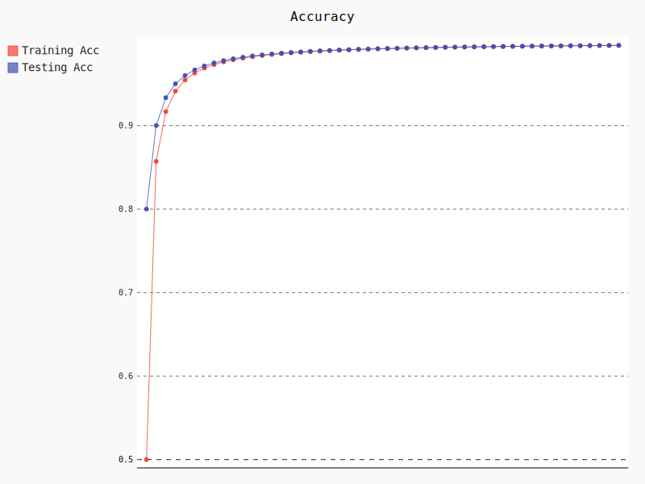

# Neural Ordinary Differential Equations

 Repository for notes, projects and snippets on NODEs. Includes results after training CNN based networks with different methods on MNIST, CIFAR-10 and CelebA datasets accordingly.

## Introduction

Neural ODEs are a method of extending [Residual Neural Networks](https://arxiv.org/abs/1512.03385) for smoother gradients and general improvements in training. The original paper [(2018) Neural Ordinary Differential Equations](https://arxiv.org/abs/1806.07366) and later on [ANODE](https://arxiv.org/abs/1902.10298) will be papers cited for their techniques and algorithms.

In addition, [Neural ODEs for undergraduate students](https://drive.google.com/file/d/13uynuOgbnbAjmbHWo8-DbS-0dlKtdF4T/view?usp=sharing) has a great introduction into the subject of matter while [Towards Understanding Normalization in Neural ODEs](https://arxiv.org/abs/2004.09222) explains new advancements in Normalizing NODEs.

## Installation

```bash
#cloning the repo
git clone https://github.com/xAlpharax/NeuralODE-Notes-Projects

#install dependencies
pip3 install -qq -r requirements.txt
```

## Training

Training the network created in dcodnn.py can be done by running the following command. Note that the weights and visuals are placed in their separate directories respectively. Furthermore, the celebA dataset and attributes can be downloaded from [img_align_celeba.zip](https://drive.google.com/file/d/0B7EVK8r0v71pZjFTYXZWM3FlRnM/view?usp=sharing) & [list_attr_celeba.txt](https://drive.google.com/file/d/0B7EVK8r0v71pblRyaVFSWGxPY0U/view?usp=sharing) and placed in drive directory.
```bash
#training large DCODNN for 50 epochs with the given parameters (CELEBA)
python3 train-node/train-celeb.py

#training medium DCODNN for 30 epochs with the given parameters (CIFAR)
python3 train-node/train-cifar-10.py

#training lighter DCODNN for 5 epochs with the given parameters (MNIST)
python3 train-node/train-mnist.py
```

Moreover, training residual networks with similar structure as the ones above is done by:
```bash
#training large DRCNN for 50 epochs with the given parameters (CELEBA)
python3 train-res/train-res-celeb.py

#training medium DRCNN for 30 epochs with the given parameters (CIFAR)
python3 train-res/train-res-cifar-10.py

#training lighter DRCNN for 5 epochs with the given parameters (MNIST)
python3 train-res/train-res-mnist.py
```

In regards to interractive training, there is a [Colab Notebook](https://colab.research.google.com/drive/1Rds-6mvsC2VGi0k-P0R0qQVsVaWrWFPg?usp=sharing) for just that.

## Results and comparison

|             | CELEBA               | CIFAR               | MNIST               |
| ----------- |:--------------------:|:-------------------:| ------------------- |
| DCODNN      | **val_acc: 0.9959**  | val_acc: 0.7059     | **val_acc: 0.9865** | 
| DRCNN       | val_acc: 0.9720      | **val_acc: 0.7545** | val_acc: 0.9824     |



## Additional weights
CelebA weights are large files(~100MB) and so would slow down the repository. Download from [drive](https://drive.google.com/drive/folders/1Rxa4Obpkz_5gmlW2gmFwnYa9GtLBkYDc?usp=sharing)

***
TO DO:
1. use the odesolvers as functios or at least experiment with them
2. catsVSdogs dataset node & resnet

View on [trello](https://trello.com/b/0BtjvVZK/neuralode-notes-projects)
***

## Contributing
In case someone would like this, pull requests are welcome. For major changes, please open an issue first to discuss what you would like to change.